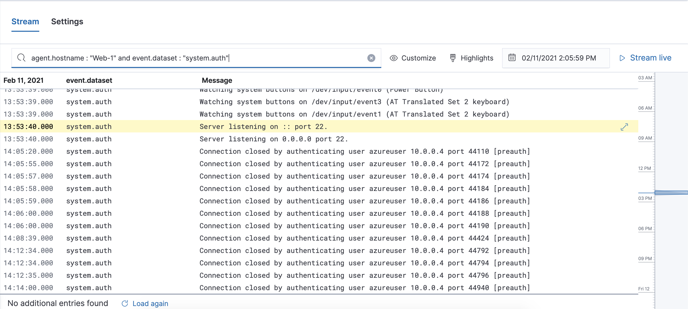
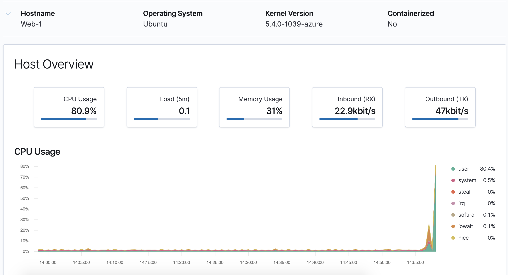
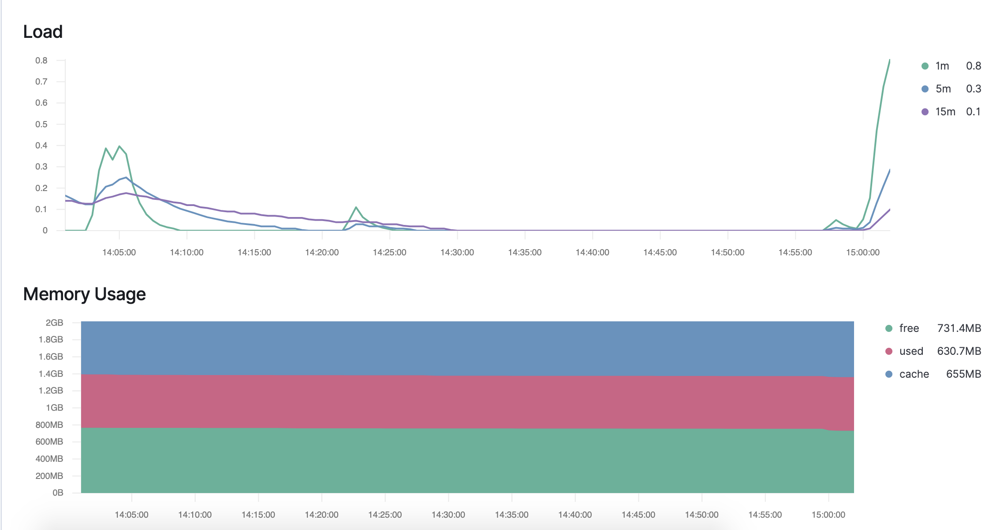

### SSH Barrage
Start by logging into your jump-box.
Run: `ssh username@ip.of.web.vm`

You should receive an error:
 ```sysadmin@Jump-Box-Provisioner:~$ ssh sysadmin@10.0.0.5```
 ```sysadmin@10.0.0.5: Permission denied (publickey).```

This error was also logged and sent to Kibana.

Run the failed SSH command in a loop to generate failed login log entries.

Search through the logs in Kibana to locate your generated failed login attempts.


### Linux Stress
From your jump box, start up your Ansible container and attach to it.
SSH from your Ansible container to one of your WebVM's.

Run `sudo apt install stress` to install the stress program.
Run `sudo stress --cpu 1` and allow stress to run for a few minutes.

View the Metrics page for that VM in Kibana. 



### wget-DOS
Log into your jump box.
Run `wget ip.of.web.vm.`

Run `ls` to view the file you downloaded from your web VM to your jump box.
``` sysadmin@Jump-Box-Provisioner:~$ ls```
```index.html ```

Run the `wget` command in a loop to generate many web requests.

Open the Metrics page for the web machine you attacked and answer the following questions:

Which of the VM metrics were affected the most from this traffic?
