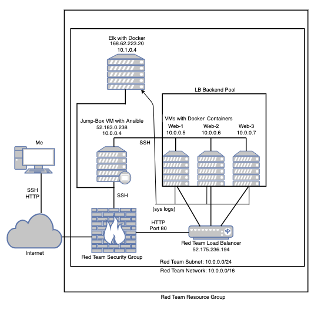
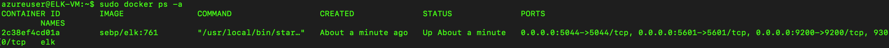

## Automated ELK Stack Deployment

The files in this repository were used to configure the network depicted below.

These files have been tested and used to generate a live ELK deployment on Azure. They can be used to either recreate the entire deployment pictured above. Alternatively, select portions of the .yml files may be used to install only certain pieces of it, such as Filebeat.

  - [Filebeat playbook](Ansible-Playbooks/filebeat-playbook.yml)

This document contains the following details:
- Description of the Topology
- Access Policies
- ELK Configuration
  - Beats in Use
  - Machines Being Monitored
- How to Use the Ansible Build

### Description of the Topology

The main purpose of this network is to expose a load-balanced and monitored instance of DVWA, the D*mn Vulnerable Web Application.

Load balancing ensures that the application will be highly available, in addition to restricting access to the network.
- What aspect of security do load balancers protect? Load balancers within a network provide redundancy in this case, contributing to the Availability aspect of the CIA security triad. Load balancers protect your servers from DoS attacks and other risks since the load balancer is the only IP exposed to the internet.  
- What is the advantage of a jump box? "Jump boxes" or SAWs (Secure Admin Workstations) creates a single point of origin before connecting to any other servers, networks, or performing any administrative tasks. Properly configured jump boxes allow us to limit who can access the jump box and what the jump box has access to, creating a much more secure network.

Integrating an ELK server allows users to easily monitor the vulnerable VMs for changes to the file systems and system traffic.
- What does Filebeat watch for? Filebeat monitors logfiles and locations that you specify and forwards them for indexing.
- What does Metricbeat record? Metricbeat records metric data from servers such as CPU, memory, or services.

The configuration details of each machine may be found below.

| Name     | Function                | IP Address | OS    |
|----------|-------------------------|------------|-------|
| Jump-Box | Gateway                 | 10.0.0.4   | Linux |
| Web-1    | Docker-DVWA Containers  | 10.0.0.5   | Linux |
| Web-2    | Docker-DVWA Containers  | 10.0.0.6   | Linux |
| Web-3    | Docker-DVWA Containers  | 10.0.0.7   | Linux |
| ELK      | Configuration VM        | 10.1.0.4   | Linux |

### Access Policies

The machines on the internal network are not exposed to the public Internet. 

Only the Jump Box machine can accept connections from the Internet. Access to this machine is only allowed from the following IP addresses:
- My Personal IP (Router IP)

Machines within the network can only be accessed by accessing the container in the Jump Box VM.
- The only machines allowed to access the ELK server are my Personal IP and the Jump Box VM at 10.0.0.4 (Private IP) thorugh a peering connection.

A summary of the access policies in place can be found in the table below.

| Name     | Publicly Accessible? | Allowed IP Addresses     |
|----------|----------------------|--------------------------|
| Jump-Box | No                   | Personal IP              |
| Web-1    | No                   | 10.0.0.4                 |
| Web-2    | No                   | 10.0.0.4                 |
| Web-3    | No                   | 10.0.0.4                 |
| ELK      | No                   | 10.0.0.4 and Personal IP |

### Elk Configuration

Ansible was used to automate configuration of the ELK machine. No configuration was performed manually, which is advantageous because you can use the configuration file to comfigure many machines after intial configuration, reducing time spent and potential misconfiguration.

The [Elk-Playbook](Ansible-Playbooks/install_elk.yml) implements the following tasks:
- Runs this playbook against the "elk" group configured in the Ansible host file. Ex. [here](Ansible-Configs/hosts)
- Installs docker.io, python3-pip, and docker (which is the Docker Python pip module).
- Increases the virtual memory and increases the virtual memory on restart.
- Downloads and installs the docker elk container.
- Enables service docker on boot.

The following screenshot displays the result of running `docker ps` after successfully configuring the ELK instance.

### Target Machines & Beats
This ELK server is configured to monitor the following machines:
- Web-1 (10.0.0.5)
- Web-2 (10.0.0.6)
- Web-3 (10.0.0.7)

We have installed the following Beats on these machines:
- Filebeat v7.4.0 and Metricbeat v7.4.0

These Beats allow us to collect the following information from each machine:
- Filebeat forwards and centralizes log data by monitoring log files and locations, logging events, and forwarding them to Elasticsearch for indexing.
- Metricbeat gathers metrics from the operating system and from services running on the server(s) you configured, then sends them to the output you specify.

### Using the Playbook
In order to use the playbook, you will need to have an Ansible control node already configured. Assuming you have such a control node provisioned: 

SSH into the control node and follow the steps below:
- Modify the /etc/ansible/hosts file to include your VMs Private IP addresses under the "webservers" group. Ex. [here](Ansible-Configs/hosts)
- Copy the [filebeat-config.yml](Ansible-Configs/filebeat-config.yml) and [metricbeat-config.yml](Ansible-Configs/metricbeat-config.yml) files to the /etc/ansible/files directory.
- Copy the [filebeat-playbook.yml](Ansible-Playbooks/filebeat-playbook.yml) and [metricbeat-playbook.yml](Ansible-Playbooks/metricbeat-playbook.yml) files to /etc/ansible/roles.
- Update the filebeat-config.yml file to include your ELK servers private IP address in line 1106 and 1806.
- Update the metricbeat-config.yml file to include your ELK servers private IP address in line 62 and 95.
- Run the playbooks using `ansible-playbook filebeat-playbook.yml` and `ansible-playbook metricbeat-playbook.yml`, and navigate to kibana at [ELK public IP]/app/kibana to check that the installation worked as expected.

_As a **Bonus**, provide the specific commands the user will need to run to download the playbook, update the files, etc._
